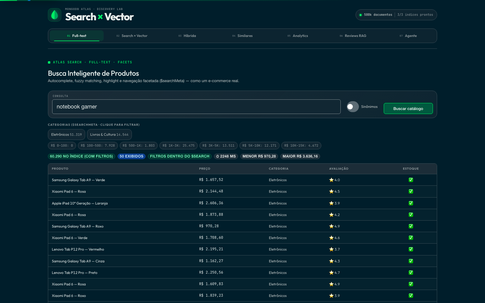
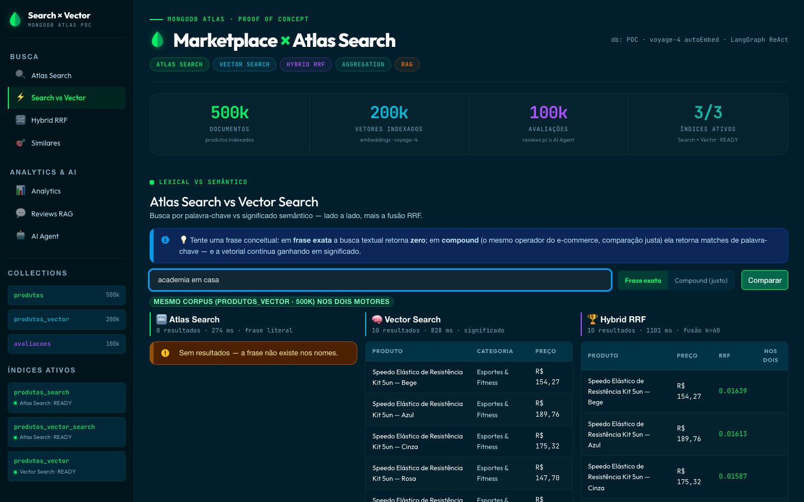
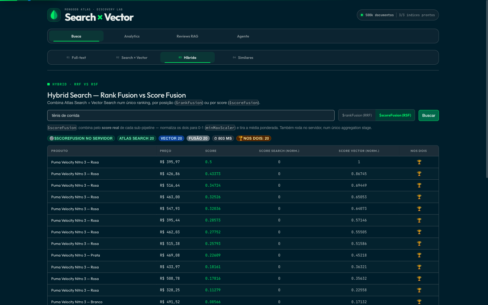
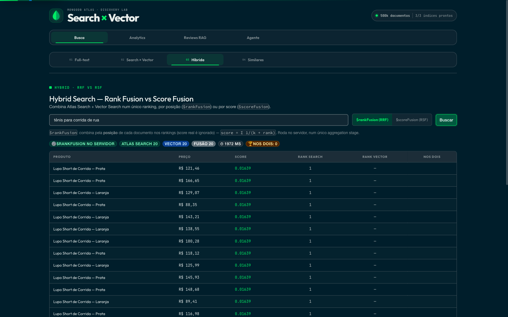
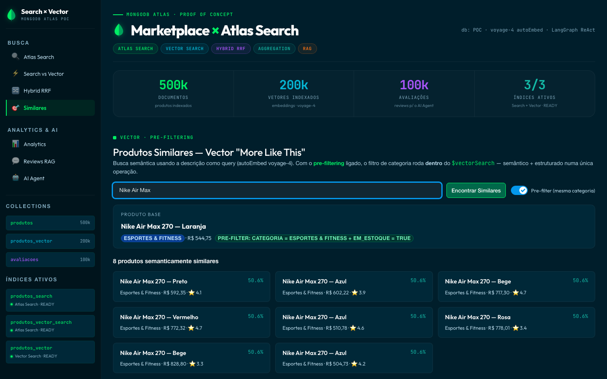
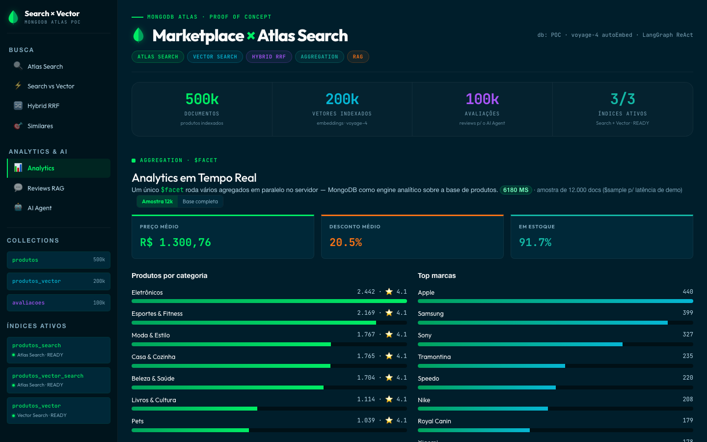
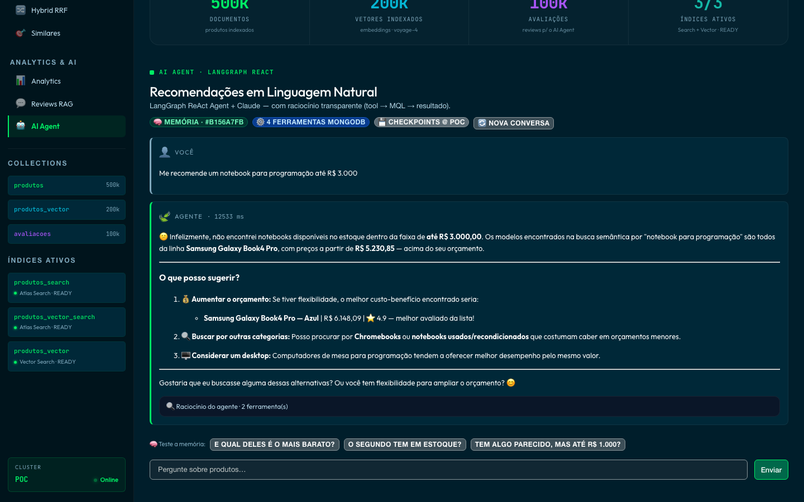

# Search & AI agent PoV on MongoDB Atlas

Most e-commerce stacks glue together a search engine, a vector database, an analytics warehouse, and a store for agent memory. This PoV runs all four on MongoDB Atlas alone, over a synthetic marketplace catalog. The generator scales to 20 million products (`TOTAL_DOCS`); the demo database currently holds 500K products, a 500K vector collection and 100K reviews.

Seven tabs, one Atlas capability in each. Every screen prints the MQL that actually ran; nothing is mocked. Point it at any dataset through `MONGODB_URI` / `DB_NAME`.

```
React + LeafyGreen  ──axios──►  FastAPI  ──►  MongoDB Atlas
     (:5273)                     (:8200)
```

The UI text is in Brazilian Portuguese on purpose (Brazilian audience); the documentation and code are in English unless noted.

## The demo, tab by tab

**1. Atlas Search**: full-text over the catalog with autocomplete, fuzzy matching (`"adidass"` → Adidas), clickable facets via `$searchMeta`, highlighting, match counts, and `scoreDetails`. Filters run inside `$search` when the index allows it, so counts reflect them; otherwise the application falls back to the other path and says so.



**2. Search vs Vector**: the same query on both engines, side by side. Exact-phrase lexical search returns **zero** for `"academia em casa"` ("home gym"); vector search understands the intent. Each engine reports its own latency.



**3. Hybrid, RRF vs RSF**: two native engines side by side. `$rankFusion` (RRF) combines by rank position; `$scoreFusion` (RSF) combines by real scores normalized with `minMaxScaler`. It falls back to RRF computed in the application, with the reason shown in the UI, when the native stage's requirements are not met (no lexical index on the vector collection, or a cluster version below the minimum).


A synthetic catalog with near-identical text across products in the same subcategory produces mass ties in the Atlas Search lexical score, and a tied score collapses `$rankFusion` (same rank for everyone) and `$scoreFusion`/`minMaxScaler` (`0/0 → 0` for everyone). This was fixed in data generation (`populate_marketplace.py`: attributes plus a second axis of variation per product); see [ADR-001](docs/adr/0001-rankfusion-vs-scorefusion.md) for the full root cause and before/after evidence. `$scoreFusion` now produces a differentiated real score:



Some residual ties remain: with finite templates there is always **some** group of documents with identical text for a fixed query. That is a property of BM25 over a finite vocabulary, not a bug. The UI shows it honestly instead of hiding it:



**4. Similar products**: vector "more like this" from a product's description, with category and stock filters running *inside* `$vectorSearch`, not after it.



**5. Analytics**: a `$facet` pipeline running several aggregations in parallel on the server. The default is a 12k `$sample`; toggle to run over the whole collection and compare timings.



**6. Review RAG**: `$search` finds the most relevant product that has reviews, MongoDB returns the reviews, and Claude summarizes strictly grounded in that data. Reviews are customer-written text: any review that looks like a prompt injection is kept out of the prompt and flagged in the UI.

**7. AI agent**: a LangGraph ReAct agent with four MongoDB tools, long-term memory through `MongoDBSaver`, and a trace built by the same functions the tools execute, byte for byte what ran. PII is masked before the model, the checkpoint and the trace see the message; direct prompt injection is answered without calling the model.



## Collections

```
POC
├── produtos          20M products      — Atlas Search: produtos_search
├── produtos_vector   500K subset       — Vector Search: produtos_vector (voyage-4, autoEmbed)
│                                       — Atlas Search: produtos_vector_search
├── avaliacoes        reviews           — review RAG + agent
├── sinonimos         synonym mappings  — source of sinonimos_produtos
└── marketplace_checkpoints(+_writes)   — LangGraph memory (TTL 30 days)
```

The 500K vector subset is a cost/build-time decision, not a limit: it is a representative `$sample`. The extra lexical index on `produtos_vector` exists because `$rankFusion` and `$scoreFusion` need both sub-pipelines on the same collection. The application detects available indexes through `$listSearchIndexes` and degrades gracefully.

## Setup

Requires Atlas 8.0+ (8.1+ for native `$rankFusion`/`$scoreFusion`) with the Voyage AI integration enabled (autoEmbed), Python 3.11+, Node 18+ and `uv`.

```bash
python3 -m venv .venv
VIRTUAL_ENV=$PWD/.venv uv pip install -r backend/requirements.txt
VIRTUAL_ENV=$PWD/.venv uv pip install -e "../_shared[llm]"   # LLM transport (Grove gateway), see below
VIRTUAL_ENV=$PWD/.venv uv pip install "anthropic>=0.116,<1"   # keep langchain-anthropic's ceiling
cp .env.example .env                                           # fill in the placeholders
```

`.env` at the repository root (placeholders in `.env.example`):

```env
MONGODB_URI=mongodb+srv://<user>:<password>@<cluster>.mongodb.net/
DB_NAME=POC
GROVE_BASE_URL=<gateway url>
GROVE_API_KEY=<gateway key>
```

**LLM access.** Every LLM call (agent and review RAG) goes through the Grove gateway via `grove_client` from the workspace package `pov-shared` (`../_shared`): `Authorization: Bearer` plus the real key in `x-api-key`, retry with backoff on 429/5xx/timeouts, a per-model circuit breaker and optional model fallback, all on by default (tune with `GROVE_*`). There is no fallback to `ANTHROPIC_API_KEY`. Without the package or the gateway, `/agent` and `/reviews-rag` answer "unavailable" and every search tab keeps working. `GET /health/llm` tells which case you are in.

**Data and indexes: one command.** `scripts/reset_demo.py` is idempotent: it clears this PoV's agent memory, (re)creates the synonyms and all three search indexes, waits until they are READY, and smoke-tests one `$search` and one `$vectorSearch`. With `--rebuild-catalog` (or on an empty database) it also drops and regenerates `produtos`, `produtos_vector` and `avaliacoes`; autoEmbed computes the embeddings inside Atlas while the vector index builds. It refuses any database that does not end in `_test` unless `ALLOW_DEMO_DB_WRITE=1`.

```bash
# test database (about 2 minutes, measured: 118 s for 20K/3K/20K docs)
.venv/bin/python scripts/reset_demo.py --db marketplace_test --rebuild-catalog \
  --products 20000 --vector 3000 --reviews 20000

# demo database: clear agent memory + verify indexes (seconds; the app never writes the catalog)
ALLOW_DEMO_DB_WRITE=1 .venv/bin/python scripts/reset_demo.py

# demo database from scratch (tens of minutes: re-embeds 500K descriptions, uses Voyage credits)
ALLOW_DEMO_DB_WRITE=1 .venv/bin/python scripts/reset_demo.py --rebuild-catalog \
  --products 500000 --vector 500000 --reviews 100000
```

**Run.**

```bash
bash start.sh                                  # backend 127.0.0.1:8200 + frontend 127.0.0.1:5273
DB_NAME=marketplace_test bash start.sh         # same app against the test database (env wins over .env)
```

The launcher serves the optimized frontend build without a watcher; use `POV_DEV=1 bash start.sh` for HMR. The build is only redone when sources, lockfile, or configuration change. Custom ports: `BACKEND_PORT=8201 FRONTEND_PORT=5274 bash start.sh`. It never kills a process that already holds a port.

**Test.**

```bash
.venv/bin/python -m unittest discover -s backend/tests          # offline: no Atlas, gateway or Langfuse
.venv/bin/python frontend/tests/e2e_demo.py                     # full demo walkthrough against the running app
.venv/bin/python scripts/bench_thesis.py --db marketplace_test --freshness   # measured thesis evidence
```

**Tracing (optional).** Set `LANGFUSE_PUBLIC_KEY`, `LANGFUSE_SECRET_KEY` (and `LANGFUSE_HOST`) to trace `/agent` and `/reviews-rag` turns. Fail-open: without keys, or with Langfuse down, it is a no-op. Traces receive text only after PII masking.

## Synonyms (optional)

The synonyms toggle needs a mapping named `sinonimos_produtos` on `produtos_search`: Atlas UI → Atlas Search → Synonyms → source collection `sinonimos`, analyzer `lucene.portuguese`. Then insert documents like this:

```json
[
  { "mappingType": "equivalent", "synonyms": ["notebook", "laptop", "computador portátil"] },
  { "mappingType": "equivalent", "synonyms": ["celular", "smartphone", "telefone"] },
  { "mappingType": "explicit", "input": ["presente"], "synonyms": ["kit", "combo", "caixa"] }
]
```

The index is rebuilt in about two minutes; the toggle warns while the build is in progress.

## Stack

React 18 + Vite + LeafyGreen · FastAPI · LangGraph (ReAct) · Claude (`claude-sonnet-5-5`, via the Grove gateway) · Voyage `voyage-4` via Atlas autoEmbed · MongoDB Atlas 8.0+.

## Production boundary

MongoDB calls have explicit server-selection, socket and query timeouts, one retry for transient and autoEmbed/Voyage throttling errors, and a readable "Atlas unreachable" answer instead of a hang. LLM calls get retry, circuit breaker and fallback from `grove_client`, plus a ReAct step limit. The AI routes share a bounded-concurrency gate and return 429 under saturation. Inputs are normalized and bounded (zero-width and control characters stripped, `NaN`/`Infinity` refused, 64 KB body limit), 422 responses never echo the payload, and aggregation errors are sanitized before reaching clients. The Docker image runs as UID 10001 and does not bundle the private `pov-shared` package, so its AI routes answer "unavailable" until you install it in the image; the API has no user authentication: put it behind an IdP/API gateway, TLS, and per-tenant quotas before any external exposure.

Component details: [`frontend/README.md`](frontend/README.md) · [`backend/README.md`](backend/README.md).

## What the thesis looks like in numbers

"Search engine + separate vector store" means two copies of the catalog, a sync pipeline and an embedding job. Here one insert is the whole pipeline. Measured on 2026-10-06 with `scripts/bench_thesis.py` (Atlas 9.0.3; numbers are this cluster, this run, not a benchmark):

| Measurement | Result |
|---|---|
| New product visible to `$search` after one `insert_one` (test db, 3K docs) | 4.0 s |
| Same product returned by `$vectorSearch`, embedding generated by autoEmbed | 17.2 s |
| Sync / embedding code maintained by the application | none |
| Hybrid on the demo db (500K): native `$rankFusion`, one aggregation | p50 502 ms, p95 3175 ms |
| Hybrid on the demo db: two queries in parallel + RRF in the app | p50 402 ms, p95 475 ms |

Native fusion is not faster here; its value is one round trip and fusion logic that lives in the database, not in every client. The latency of each engine is shown on every screen.

## License

MIT, see [LICENSE](LICENSE).
